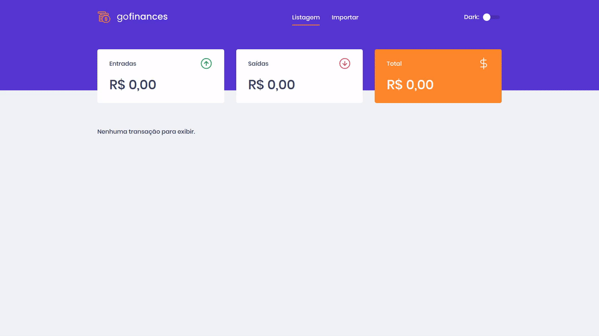
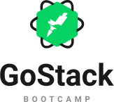

<h1 align="center">
    
</h1>

<p align="center">
  

  

  

  <a href="https://github.com/Diziano/gofinances/commits/master">
    
  </a>

  <a href="https://github.com/Diziano/gofinances/issues">
    
  </a>

  
</p>

<br/>

<h3>
  
</h3>

<br/>

<p align="center">
  <a href="#computer-projeto">Projeto</a>&nbsp;&nbsp;&nbsp;|&nbsp;&nbsp;&nbsp;
  <a href="#rocket-tecnologias">Tecnologias</a>&nbsp;&nbsp;&nbsp;|&nbsp;&nbsp;&nbsp;
  <a href="#bookmark-layout">Layout</a>&nbsp;&nbsp;&nbsp;|&nbsp;&nbsp;&nbsp;
  <a href="#thinking-como-contribuir">Como contribuir</a>&nbsp;&nbsp;&nbsp;|&nbsp;&nbsp;&nbsp;
  <a href="#gear-como-executar">Como executar</a>&nbsp;&nbsp;&nbsp;|&nbsp;&nbsp;&nbsp;
  <a href="#memo-licença">Licença</a>
</p>

<br/>

## :computer: Projeto

Essa é uma aplicação de finanças que encontra-se em desenvolvimento. Ela lista transações financeiras de entrada e saída, permitindo o upload de novas transações através da importação de arquivos CSV.
Este é um projeto de próposito didático que está sendo desenvolvido durante o Bootcamp GoStack 11 da [Rocketseat](https://rocketseat.com.br/).

O arquivo CSV para imporação de transações deve seguir este [modelo](.github/file.csv).

<br/>

## :rocket: Tecnologias
Esse projeto foi desenvolvido com as seguintes tecnologias:

#### Front-end
- [ReactJS](https://github.com/facebook/react)
- [TypeScript](https://github.com/microsoft/TypeScript)
- [styled-components](https://github.com/styled-components/styled-components)
- [axios](https://github.com/axios/axios)
- [ESLint](https://github.com/eslint/eslint)
- [Prettier](https://github.com/prettier/prettier)

#### Back-end

- [Node.js](https://nodejs.org/en)
- [TypeScript](https://github.com/microsoft/TypeScript)
- [Express](https://github.com/expressjs/express)
- [TypeORM](https://github.com/typeorm/typeorm)
- [ESLint](https://github.com/eslint/eslint)
- [Prettier](https://github.com/prettier/prettier)

<br/>

## :bookmark: Layout

O layout pode ser acessado através da página do Figma, [neste link](https://www.figma.com/file/VgK3hsmyGbqiGu9FdqfUzF/GoMarketplace?node-id=0%3A1).
Você precisará uma conta (gratuita) no Figma pra inspecionar o layout e obter detalhes de cores, tamanhos, etc.

<br/>

## :thinking: Como contribuir

- Faça um fork desse repositório;
- Cria uma branch com a sua feature: `git checkout -b minha-feature`;
- Faça commit das suas alterações: `git commit -m 'feat: Minha nova feature'`;
- Faça push para a sua branch: `git push origin minha-feature`.

Depois que o merge da sua pull request for feito, você pode deletar a sua branch.

<br/>

### :gear: Como executar


```bash

    # Clonar o repositório
    $ git clone https://github.com/diziano/gofinances.git

    # Navegar para o diretório
    $ cd gofinances

```
#### Back-end

- No arquivo [ormconfig.json](ormconfig.json) configure os parâmetros de acesso ao banco de dados (username, password e database);

- No arquivo [src/database/index.jsormconfig.json](src/database/index.jsormconfig.json) o nome do banco de dados dos testes (gofinances_tests);

- Para alterações do banco de dados aconselha-se utilizar a CLI do TypeORM: <code>yarn typeorm {seu comando}</code>. Confira a documentação [aqui](https://typeorm.io/).

```bash

    # Instalar as dependências
    $ yarn
    
    # Executar migrations para criação das tabelas nas base de dados
    $ yarn typeorm migration:run

    # Iniciar o projeto
    $ yarn start
    
    # Iniciar o projeto em desenvolvimento
    $ yarn dev:server
    
    # Executar testes
    $ yarn test
```

#### Front-end

```bash

    # instalar as dependências
    $ yarn

    # Iniciar o projeto
    $ yarn start
   
    # Executar testes
    $ yarn test
    
    # Executar build
    $ yarn build
```

<br/>

## :memo: Licença
Esse projeto está sob a licença MIT. Veja o arquivo [LICENSE](LICENSE.md) para mais detalhes.

---

Made with :black_heart: by Diziano

<br/>

<p align="right">
  
  &nbsp;&nbsp;&nbsp;&nbsp;&nbsp;&nbsp;
  
</p>
